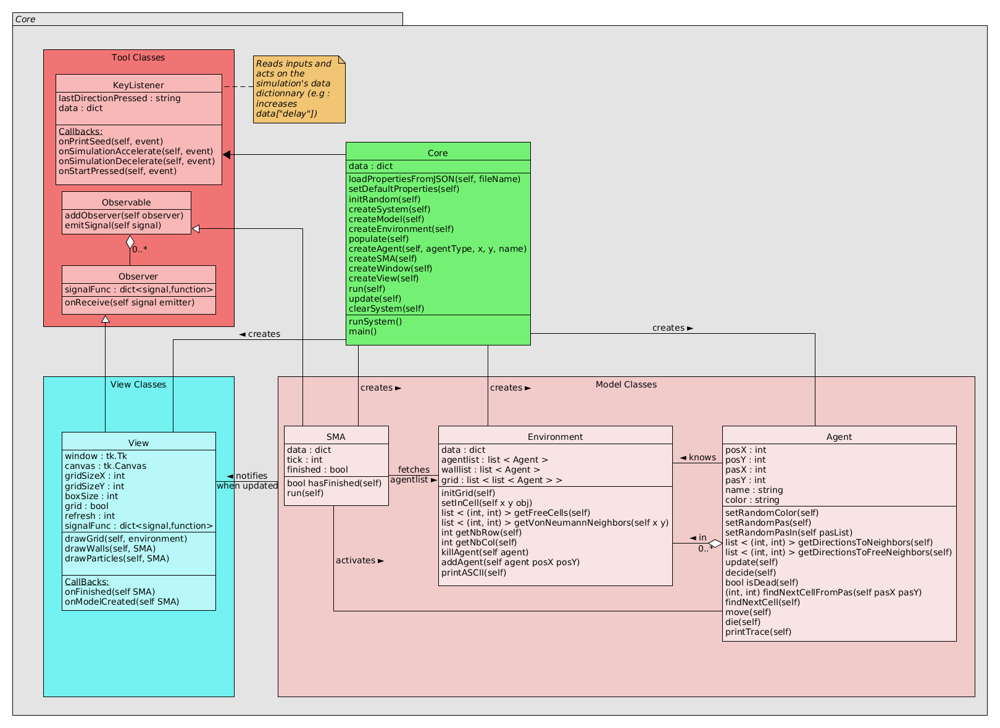

# TP -- S.M.A Architecture générale classique
###### Tristan Camus & Arnaud Cojez
______________________________________________

## CORE
N'est pas utilisable en tant que tel, doit être hérité.
Voir les projets [Particles](/particles/), [Wator](/wator/) ou [Avatar](/avatar/) pour des exemples d'utilisation.

______________________________________________
##UML

