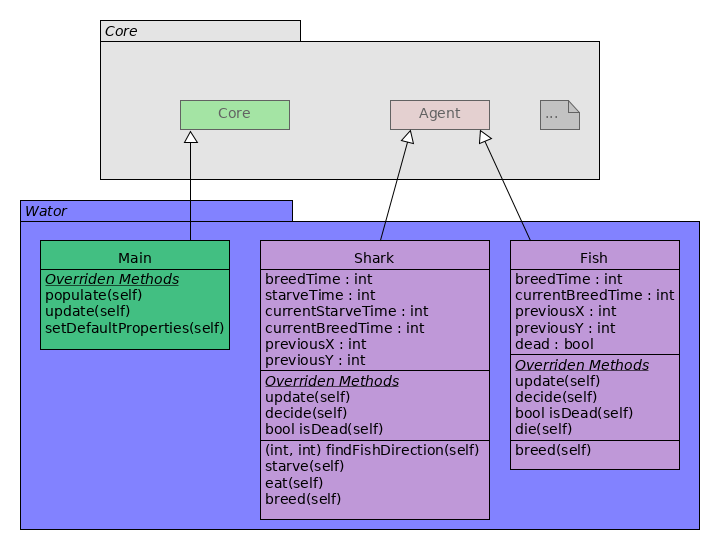

# TP2 -- S.M.A Travail sur les comportements
###### Tristan Camus & Arnaud Cojez
______________________________________________

## Usage :

`$ python3 Main.py [properties_file.json]`

Le fichier properties est en format JSON, prendre exemple sur le fichier `properties.json` fourni.

## Options du fichier JSON

- `gridSizeX` : Nombre de colonnes de la grille
- `gridSizeY` : Nombre de lignes de la grille
- `torus` : *true* si le nombre est torique, *false* sinon
- `canvasSizeX` : Largeur en pixels de la fenêtre
- `canvasSizeY` : Hauteur en pixels de la fenêtre
- `boxSize` : Taille en pixels d'une case de la grille (0 = calculée automatiquement en fonction des options *canvasSize*)
- `delay` : Délai en millisecondes entre chaque tick
- `scheduling` : Type de séquenceur utilisé : par défaut séquentiel, *"random"* pour le séquenceur aléatoire
- `nbTicks` : Nombre de ticks
- `grid` : *true* pour afficher la grille, *false* sinon
- `trace` : *true* pour afficher la trace, *false* sinon
- `seed` : Graine utilisée pour initialiser les générateur de nombres pseudo-aléatoires. 0 pour utiliser une graine aléatoire
- `refresh` : Nombre de ticks entre chaque rafraîchissement de l'affichage
- `autoquit` : *true* pour fermer la fenêtre après exécution, *false* sinon
- `nbSharks` : Nombre de requins
- `nbFishes` : Nombre de poissons
- `sharkBreedTime` : Nombre de tours avant qu'un requin puisse se reproduire
- `sharkStarveTime` : Nombre de tours qu'un requin ne meurt de faim
- `fishBreedTime` : Nombre de tours avant qu'un poisson puisse se reproduire

______________________________________________
##UML

